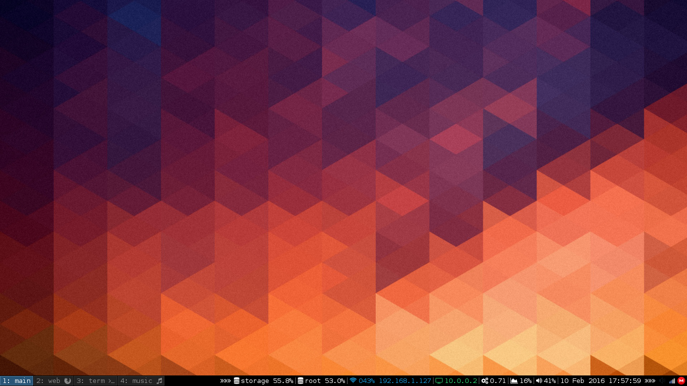
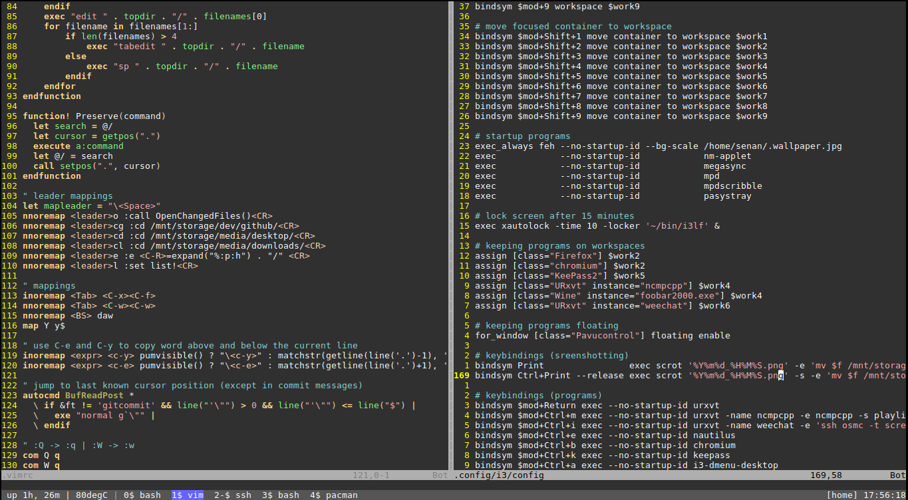
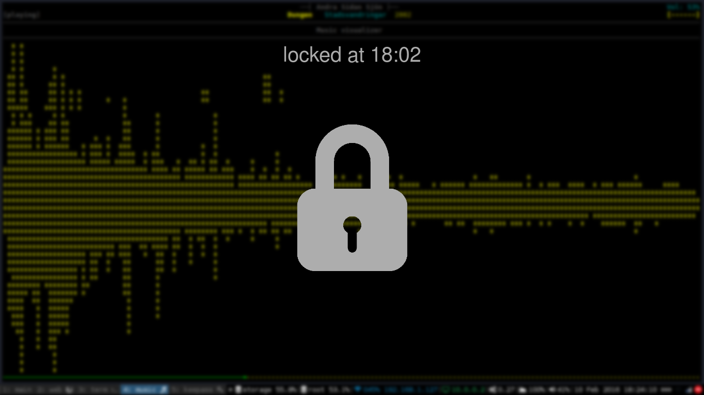
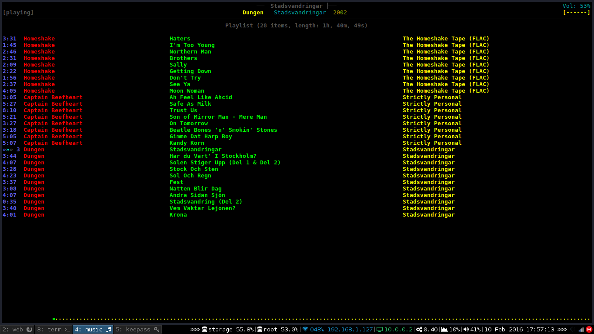

# Installation 

install [GNU Stow](https://www.gnu.org/software/stow/), then:  
(note: you can run `./install_common && ./install_extra` anytime after this with more files/folders in public_*/)

    $ mv [your current dotfiles] [somewhere else]
    $ cd ~ && git clone https://github.com/sentriz/dotfiles.git && cd dotfiles
    $ chkstow -t ~ # ensure home is clean
    $ mkdir -p .vim/bundle # ensure stow unfolds .vim for second last step
    $ ./install_common
    $ ./install_extra # if you like
    $ git clone https://github.com/VundleVim/Vundle.vim.git ~/.vim/bundle/Vundle.vim
    $ vim +PluginInstall +qall

# Screenshots

